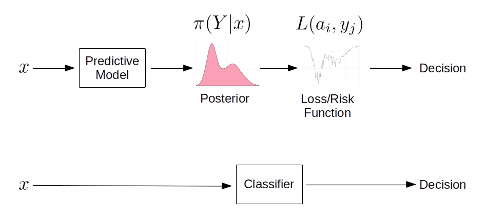

For a while, I've been thinking about the deployment of predictive algorithms in clinical decision support.  Specifically, about the difference between what we understand about a model's performance from the publication describing it and how this might be less informative when deployed.  In short: what is the value of knowing that a model has good balanced accuracy or a high area under the ROC curve when sat with a patient and using the tool to make a clinical decision.    

Frequently in medical applications of machine learning we see summary measures of performance used to demonstrate the competence of the model typically reported as sensitivities, specificities, balanced accuracy, area under the ROC curve and so on.  These measures assume that for an input $x$ (a patient) we get an output $Y = F(x)$ representing for example, "negative" or "positive" caseness.  

If the system $F$ is designed to **classify** patients, then it will deliver discrete 'yes / no' answers e.g. $Y \in \{0,1\}$; canonical examples include the [support-vector machine (SVM)](https://en.wikipedia.org/wiki/Support-vector_machine).  Baked-into these algorithms is a **decision rule** operating over a continuous value; in SVMs, for example, the decision rule classifies each patient by dichotomising the signed distance of $x$ from the class-seperating hyperplane.  If using a **classifier** makes sense in the context of it's clinical deployment you might want the algorithm to report a definitive dichotomised answer and summary measures like sensitivity and specificity (perhaps) make sense.

Compare this with [logistic regression](https://en.wikipedia.org/wiki/Logistic_regression) (often used as if it were a classifier) where the purpose is to estimate the **probability of an event**, i.e. that a patient is positive or negative.  Often in these cases, the decision rule is 'bolted on' and that's when people invoke ROC curves and compute accuracies at an operating threshold that maximises the trade-off between sensitivity and specificity e.g. by [maximising Youden's J-statistic](https://en.wikipedia.org/wiki/Youden%27s_J_statistic).  It's here that the decision rule and it's deployment context matter.

It seems to me that patients and clinicians would probably want more information than a pure classifier provides and most likely would prefer to know the **actual** continuous score -- the "output"" of $F(x)$.  

Further, a patient and clinician might want to understand the decision rule and it's assumptions.  For example, assume for a deployed predictive model $F$ and a new patient, $F(x) = 0.79$ and this represents (or is proportional to) the likelihood of being a positive case.  The predictive model being deployed has an operating threshold of $0.80$ for declaring a positive case and this threshold was determined by maximising the trade-off between sensitivity and specificity.  Recall that sensitivity is the ratio $TP/(TP+FN)$ and specificity is the ratio $TN/(TN+FP)$.  Amongst other things, I'd want to know:

  * in determining the operating threshold, were true positives and false negatives given equal weight ? For example, in the context of predicting a rare but serious event, a false negative can be orders-of-magnitude more 'costly' than the model correctly determining cases that are true positives or true negatives.
  
  * in the example above, $F(x) = 0.79$ is 0.01 below the operating threshold for declaring a *positive* case -- boundary cases near the operating threshold, demand closer inspection and at least, consideration of the **uncertainty** in the output of $F$.  

A more elaborate version of this discussion is [here](https://github.com/danwjoyce/summ-performance/blob/master/revised_predictive_decisions.pdf) and summarised in a [short paper](https://jamanetwork.com/journals/jamapsychiatry/article-abstract/2758828).

So, the problem of 'declaring' a prediction can be cast as a problem in statistical [decision theory](https://en.wikipedia.org/wiki/Decision_theory).  Being only vaguely familiar with similar ideas from signal detection models in psychophysics [@green1966signal], I decided to deep-dive into the details of using posterior distributions to arrive at decisions via loss and risk functions.  I found the ideas are fairly intuitive and are well described e.g. in [@duda2012pattern] and [@bishop2006pattern].  It was harder for me to operationalise these; for example, I frequently found explainations that the $L_0$ "zero-one" loss function delivers the mode of a (posterior) distribution, but examples of this in action were harder to come by.   

```{r echo = FALSE, results='hide', warning = FALSE, message = FALSE}
rm( list = ls() )
knitr::opts_chunk$set(echo = TRUE)
require(ggplot2)
require(gridExtra)
require(kableExtra)
require(latex2exp)
# globals for presentation
basictheme <- theme_minimal() + 
  theme(axis.title = element_text(size = 14),
        axis.text = element_text(size = 12),
        plot.title = element_text(size = rel(1.25), face = "bold", hjust = 0.5 ))

# Some helper functions
range01 <- function(x){(x-min(x))/(max(x)-min(x))}
```

# Predictions {#sec-predictions}
```{r, echo = FALSE}

```

As above, assume we have a model $F(x)$ that delivers a continuous score $Y$ for an outcome/case/event given some "input" measurement or feature(s), $x$ for a patient.  Importantly, the model delivers outputs in the form of posterior probabilities $\pi(Y|x) = \Pr(Y=y|x)$;  for example, the probability of being a positive case is $\pi(Y=1|x)$ and  $\pi(Y=0|x) = 1 - \pi(Y=1|x)$ being the probability of a negative case.  

So for any patient $x$, we will have a posterior distribution -- rather than a single *point* summary.

This is an important distinction: after inferring (learning) a model that delivers posterior probabilities, we can then *deliberately* design and implement a decision process -- in contrast to solving the related problem of **discrimination** or **classification**, where we find a direct mapping from each input $x$ to a discrete, often binary, output and sacrifice an estimate of uncertainty (see Ch. 1.5 of [@bishop2006pattern] for more detail).  


We are used to seeing *point estimates* as outputs from predictive models given some input e.g. $\pi( Y = 1 | x) = 0.78$ and sometimes, with a measure of uncertainty on that output (for example, the standard error on predicted values from [`predict.glm()`](https://stat.ethz.ch/R-manual/R-devel/library/stats/html/predict.glm.html) in `R`).  

This point value is a summary of the [posterior distribution](https://en.wikipedia.org/wiki/Probability_distribution) of $Y$ (for example, the mean) and represents the output of a decision making process.

# Setup 
Assume that for some predictive model, we present a single patient $x$ and we are able to access the posterior distribution of $Y$ given $x$ i.e. we can obtain samples from the posterior distribution for that patient denoted $\pi(Y|x)$; for example:  

```{r echo = TRUE, fig.align='center', out.width="70%"}
# to ensure reproducible result
set.seed(3141)
# simulate a bimodal posterior distribution $\pi(Y|x)$
samples <- range01( c(rnorm( 1000, mean = 0, sd = 1 ), rnorm( 1000, mean = 5, sd = 2) ) )
df <- data.frame( y = samples )
ggplot( df, aes( y ) ) +
  geom_density( fill = "#fa9fb5") + 
  ylab("Density\n") + 
  xlab("\nScore (Y)") + basictheme
```


We have 2000 samples from $\pi(Y|x)$ stored as `samples` (usually, these samples will be from the [posterior predictive distribution](https://en.wikipedia.org/wiki/Posterior_predictive_distribution) obtained by e.g. MCMC sampling):
```{r}
round( samples[1:10], 3 )
```


and the following code will give us a `data.frame` that represents an approximation to the probability distribution function as a lookup table (basically, a histogram):
```{r}
pdfFromSamples <- function(a, b, delta, samples) {
  H <- hist( samples, plot = FALSE, breaks = seq(a, b, by = delta) )
  ret <- data.frame(
    mids  = H$mids,
    freq  = H$counts
  )
  ret$P <- ret$freq / sum(ret$freq)
  return(ret)
}
```

For example, we can examine $\pi(Y|x)$ in the region $Y \in [0.5,0.6]$ with a bin-width of `delta = 1/50` as follows:
```{r}
pdf.Y <- pdfFromSamples(0, 1, delta = 1/50, samples )
knitr::kable( pdf.Y[ pdf.Y$mids >= 0.5 & pdf.Y$mids <= 0.6, ], 
              format = "html", 
              align = 'c', 
              full_width = FALSE,
              row.names = FALSE ) %>%
        kable_styling(position = "center")
```

With some abuse of notation, we can state that (approximately) $\pi(Y=0.55|x) = 0.0285$ and $\pi(Y=0.59|x) = 0.0240$.

# Loss Functions {#sec-loss}

Consider the task of choosing a summary of the information contained in the posterior distribution $\pi(Y|x)$ as a single (point) value.  We can see that the score $Y$ ranges from 0 to 1 and we could potentially pick any one of an infinite number of values as our chosen point summary (of course, some will be meaningful and others less so).  

To make this concrete, we'll cheat and look-ahead to the answer.  One meaningful decision to summarise $\pi(Y|x)$ is to choose the **mode**:

```{r echo = TRUE, fig.align='center', out.width="70%"}
pdf.Y <- pdfFromSamples(0, 1, delta = 1/100, samples )

mode.pdf.Y <- pdf.Y$mids[ order( pdf.Y$freq, decreasing = TRUE) ][1]

pdf.plot <- ggplot( pdf.Y, aes( x = mids, y = P ) ) + 
  geom_col( fill = "#fa9fb5" ) + 
  xlab("Score (Y)") +
  ylab(TeX('$\\pi(Y|x)')) +
  basictheme

mode.plot <- pdf.plot + 
      geom_vline( xintercept = mode.pdf.Y, colour = "black", size = 2 ) +
      annotate( geom = "label", 
            label = paste0( "Mode = ", mode.pdf.Y ), 
            x = mode.pdf.Y, y = 0.01)

print( mode.plot )
```

Now assume we don't have this information but instead, let $a_{i}$ be one such candidate decision for the point summary.  The actual point summary is $y_{j} \in [0,1]$.

We define the cost of choosing $a_{i}$ -- where the true value is $y_{j}$ -- as the **loss function** $L(a_{i},y_{j})$.  Now, construct a loss function that penalizes any candidate $a_{i}$ by a single unit if $a_{i}$ is not equal to $y_{j}$ (incorrect) and zero if $a_i$ is equal to $y_{j}$; this is the so-called "zero-one" loss function:

$$
L_{0}(a_{i},y_{j}) = \begin{cases}
          0 & \text{if}\ a_{i} = y_{j} \\
          1 & \text{otherwise}
    \end{cases}
$$

Now, we propose an arbitrary candidate $a_{1} = 0.555$ and we want to know the associated loss over the range of possible values of $y_{j}$:  

```{r echo = TRUE, fig.align='center', out.width="70%", warning = FALSE}
# the range of possible values $y_{j}$
y <- pdf.Y$mids
# our estimate $a_{i}$
a1 <- 0.555

# the L_{0} loss function:
loss0 <- function( y, a ) { ifelse( a == y, 0, 1 ) }

# the loss function evaluated over the range $y_{j}$
l0.ex <- data.frame( mids = pdf.Y$mids, loss.ex1 = loss0( y, a1 ) )

loss.plot <- ggplot( l0.ex, aes( x = l0.ex$mids, y = loss.ex1) ) +
  geom_line( colour = "#636363" ) +
  xlab(TeX('$y_{j}$')) +
  ylab(TeX('$L_{0}$')) +
  basictheme

print( loss.plot )

```

Let's repeat the same process for two other (arbitrarily chosen) candidates $a_{2} = 0.095$ and $a_{3} = 0.755$:
```{r echo = TRUE, fig.align='center', out.width="70%"}
a2 <- 0.095
a3 <- 0.755

# the loss function evaluated over the range $y_{j}$
l0.ex$loss.ex2 <- loss0( y, a2 )
l0.ex$loss.ex3 <- loss0( y, a3 )

loss.plot <- ggplot( l0.ex ) +
  geom_line( aes( x = mids, y = loss.ex1 ), colour = "#bdbdbd" ) +
    annotate( geom = "label", 
                label = TeX('$a_{1}$', output="character"),
                parse = TRUE,
                x = a1, y = 0.25) +
  geom_line( aes( x = mids, y = loss.ex2 ), colour = "#969696" ) +
    annotate( geom = "label", 
                label = TeX('$a_{2}$', output="character"),
                parse = TRUE,
                x = a2, y = 0.25) +
  geom_line( aes( x = mids, y = loss.ex3 ), colour = "#636363" ) +
    annotate( geom = "label", 
                label = TeX('$a_{3}$', output="character"),
                parse = TRUE,
                x = a3, y = 0.25) +
  xlab(TeX('$y_{j}$')) +
  ylab(TeX('$L_{0}$')) +
  basictheme

print( loss.plot )

```

Clearly using the loss function we get 'spikes' when our candidates coincide with a value in the range of $y_{j}$.  

But, what we care about is loss associated with a candidate with respect to the probability of each possible value $Y=y_j$; so we weight the loss associated with each "decision" (each candidate $a_{i}$) by the posterior probability of $Y = y_{j}$: 

$$
L_0(a_{i},y_{j})\pi(y_{j}|x)
$$

This leads us to consider the **risk** associated with each candidate.  In essence, we want to know the loss associated with $a_{i}$ when the true value is $y_{j}$ weighted by how likely or how frequently we see $y_{j}$.

# Risk Functions {#sec-risk-functions}

We could continue randomly choosing candidates but instead, we'll be systematic and check all values of $a_{i}$.  At the same time, we'll shift representation and instead of plotting the loss function for each candidate against the range of $y_{j}$, we'll compute a **risk function** for each candidate as the [expected value](https://en.wikipedia.org/wiki/Expected_value) of the loss function evaluated for each $a_{i}$:

$$
\mathbb{E}[L_0(a_{i},y_{j})] = \sum_{j} \underbrace{L_{0}(a_{i},y_{j})}_\text{loss} \underbrace{\pi(y_{j}|x)}_\text{posterior}
$$

Then, instead of $y_{j}$ on the horizontal axis and $L_{0}$ on the vertical, we instead show candidates $a_{i}$ on the horizontal with the risk $\mathbb{E}[L]$ on the vertical:

```{r echo = TRUE, fig.align='center', out.width="70%"}
# all candidate values for $a_{i}$ 
a <- pdf.Y$mids
# the range of values for $y_{j}$
y <- pdf.Y$mids

pdf.Y$risk.L0 <- rep(NA, nrow(pdf.Y))

for( i in 1:length( a ) ) {
  # compute risk function at each candidate $a_{i}$
  # with reference to the above equation
  pdf.Y$risk.L0[i] <- sum(                     # sum over j
                        loss0(y, a[i]) *       # loss
                        pdf.Y$P                # posterior
                      ) 
}

risk.plot <- ggplot( pdf.Y ) +
  geom_line( aes( x = mids, y = risk.L0  ), colour = "#636363" ) +
  xlab(TeX('$a_{i}$')) +
  ylab(TeX('$E(L_{0})$')) +
  basictheme

print(risk.plot)
```

# Optimal Decision {#sec-optimal-decision}
Our question is now: what is the best **action** -- or decision -- over our candidates $a_{i}$ to choose as the point summary given the loss function $L_{0}$ and the posterior $\pi(Y|x)$?

The answer is, the $a_{i}$ that **minimises** the risk (expected loss).  Implementing this, we arrive at:

```{r echo = TRUE, fig.align='center', out.width="70%"}
# find the $a_{i}$ that minimises the risk function
min.risk.L0 <- pdf.Y$mids[ which.min( pdf.Y$risk.L0 ) ]

risk.plot <- risk.plot + 
    geom_vline( xintercept = min.risk.L0, size = 2 ) +
      annotate( geom = "label", 
            label = paste0( "Minimum = ", min.risk.L0 ), 
            x = mode.pdf.Y, y = 0.99)
print( risk.plot )
```
Compare with the distribution of $\pi(Y|x)$:

```{r echo = TRUE, fig.align='center', out.width="70%"}
grid.arrange(risk.plot, mode.plot, nrow = 2, ncol = 1)
```

The result then, can be summarised as:

  * Under the **zero-one loss function**, $L_0$, the action/decision $a_{i}$ (point summary) which minimises the risk function (expected loss) is the **mode** of the posterior distribution $\pi(Y|x)$

# Other Loss Functions
We can repeat the same process as for section \@ref(sec-loss) through \@ref(sec-optimal-decision) with different loss functions.

The **linear loss** $L_{1}$ loss is defined as:
$$
L_{1}(a_{i},y_{j}) = \begin{cases}
          c_{1} |a_{i} - y_{j}| & \text{ if } a_{i} \leq y_{j} \\
          c_{2} |a_{i} - y_{j}| & \text{ if } a_{i} > y_{j} \\
    \end{cases}
$$
Where $c_{1}$ and $c_{2}$ are constants.  If $c_{1} = c_{2}$ we arrive at the **median** of the posterior, as follows:

```{r echo = TRUE, fig.align='center', out.width="70%"}
# the linear loss function
loss1 <- function( y, a, c1, c2 ) {
  ifelse(
    a <= y, c1 * abs( a - y ),
            c2 * abs( a - y )
  )
}

pdf.Y$risk.L1 <- rep(NA, nrow(pdf.Y))

# set constants equal
c1 <- c2 <- 1

for( i in 1:length( a ) ) {
  # compute risk function at each candidate $a_{i}$
  pdf.Y$risk.L1[i] <- sum( 
                        loss1(y, a[i], c1, c2) * 
                        pdf.Y$P
                      ) 
}

# find the minimum
min.lossL <- pdf.Y$mids[ which.min( pdf.Y$risk.L1 ) ]
```

The minimum of the risk function is `r min.lossL`:

```{r echo = TRUE, fig.align='center', out.width="70%"}
risk.plot <- ggplot( pdf.Y ) +
  geom_line( aes( x = mids, y = risk.L1  ), colour = "#636363" ) +
  xlab(TeX('$a_{i}$')) +
  ylab(TeX('$E(L_{1})$')) +
  geom_vline( xintercept = min.lossL, colour = "black", size = 2 ) +
    annotate( geom = "label", 
              label = paste0( "Minimum = ", round( min.lossL, 2) ), 
              x = min.lossL, y = 0.4) +
  basictheme

median.plot <- pdf.plot + 
      geom_vline( xintercept = median( samples ), colour = "black", size = 2 ) +
      annotate( geom = "label", 
            label = paste0( "Median = ", round( median(samples), 2 ) ), 
            x = median(samples), y = 0.01)

grid.arrange(risk.plot, median.plot, nrow = 2, ncol = 1)

```

More generally, for positive constants, the $c_{1}/(c_{1}+c_{2})$ quantile of the posterior distribution can be found.  For example, we can obtain the 25th and 75th percentiles: 

```{r echo = TRUE, fig.align='center', out.width="70%"}
pdf.Y$risk.L1_75 <- rep(NA, nrow(pdf.Y))
pdf.Y$risk.L1_25 <- rep(NA, nrow(pdf.Y))

# set constants
q95 <- 0.75
q05 <- 0.25
c1 <- 1
c2.q95 <- (c1/q95) - c1
c2.q05 <- (c1/q05) - c1

for( i in 1:length( a ) ) {
  # compute risk function at each candidate $a_{i}$
  pdf.Y$risk.L1_75[i] <- sum( 
                            loss1(y, a[i], c1, c2.q95) * 
                            pdf.Y$P
                         ) 
  pdf.Y$risk.L1_25[i] <- sum( 
                            loss1(y, a[i], c1, c2.q05) * 
                            pdf.Y$P
                         ) 
}

# find the minima
min.lossL_75 <- pdf.Y$mids[ which.min( pdf.Y$risk.L1_75 ) ]
min.lossL_25 <- pdf.Y$mids[ which.min( pdf.Y$risk.L1_25 ) ]

risk.plot <- ggplot( pdf.Y ) +
  geom_line( aes( x = mids, y = risk.L1_75  ), colour = "#1f78b4" ) +
  geom_line( aes( x = mids, y = risk.L1_25  ), colour = "#33a02c" ) +
  xlab(TeX('$a_{i}$')) +
  ylab(TeX('$E(L_{1})$')) +
  geom_vline( xintercept = min.lossL_75, colour = "#1f78b4", size = 2 ) +
    annotate( geom = "label", 
              label = paste0( "Minimum = ", round( min.lossL_75, 3) ), 
              x = min.lossL_75, y = 1.25) +
  
  geom_vline( xintercept = min.lossL_25, colour = "#33a02c", size = 2 ) +
    annotate( geom = "label", 
              label = paste0( "Minimum = ", round( min.lossL_25, 3) ), 
              x = min.lossL_25, y = 1.25) +
  basictheme

fun.q75 <- as.numeric( round( quantile(samples, probs = c(0.75)), 3 ) )
fun.q25 <- as.numeric( round( quantile(samples, probs = c(0.25)), 3 ) )

quantile.plot <- pdf.plot + 
      geom_vline( xintercept = fun.q75, colour = "#1f78b4", size = 2 ) +
        annotate( geom = "label", 
              label = paste0( "75th = ", fun.q75 ), 
              x = fun.q75, y = 0.01) +
      geom_vline( xintercept = fun.q25, colour = "#33a02c", size = 2 ) +
        annotate( geom = "label", 
              label = paste0( "25th = ", fun.q25 ), 
              x = fun.q25, y = 0.01)

grid.arrange(risk.plot, quantile.plot, nrow = 2, ncol = 1)

```

In the top panel of the figure above, the green and blue lines represents the risk using the linear loss function with constants configured to locate the 25th and 75th percentile respectively.  The bottom panel shows the same result obtained directly from the `quantile()` function operating directly on the raw `samples`.

To complete the loss functions for common measures of central tendency, we have the $L_{2}$ **quadratic** loss function:

$$
L_{2}(a_{i},y_{j}) = (a_{i} - y_{j})^2
$$

Here's the result for quadratic loss:

```{r echo = TRUE, fig.align='center', out.width="70%"}
# the quadratic loss function
loss2 <- function( y, a ) {
  return( 
    (a - y)^2 
  )
}

pdf.Y$risk.L2 <- rep(NA, nrow(pdf.Y))

for( i in 1:length( a ) ) {
  # compute risk function at each candidate $a_{i}$
  pdf.Y$risk.L2[i] <- sum( 
                        loss2(y, a[i]) * 
                        pdf.Y$P
                      ) 
}

# find the minimum
min.lossL2 <- pdf.Y$mids[ which.min( pdf.Y$risk.L2 ) ]

risk.plot <- ggplot( pdf.Y ) +
  geom_line( aes( x = mids, y = risk.L2  ), colour = "#636363" ) +
  xlab(TeX('$a_{i}$')) +
  ylab(TeX('$E(L_{2})$')) +
  geom_vline( xintercept = min.lossL2, colour = "black", size = 2 ) +
    annotate( geom = "label", 
              label = paste0( "Minimum = ", round( min.lossL2,3) ), 
              x = min.lossL2, y = 0.25) +
  basictheme

mean.plot <- pdf.plot + 
      geom_vline( xintercept = mean( samples ), colour = "black", size = 2 ) +
        annotate( geom = "label", 
              label = paste0( "Mean = ", round( mean( samples ), 3 ) ), 
              x = mean(samples), y = 0.005)

grid.arrange(risk.plot, mean.plot, nrow = 2, ncol = 1)
      
```

The estimate from `quantile()` plotted on the bottom panel differs from the top panel (the mean estimated by minimising the risk function) due to the granularity (`delta = 1/100`) of the approximation of the distribution function used in the code.

# References
