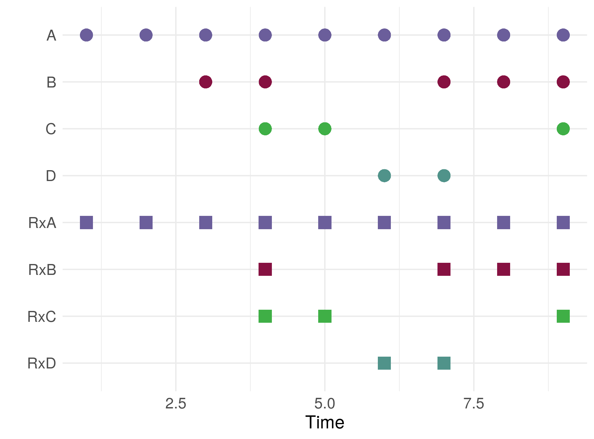
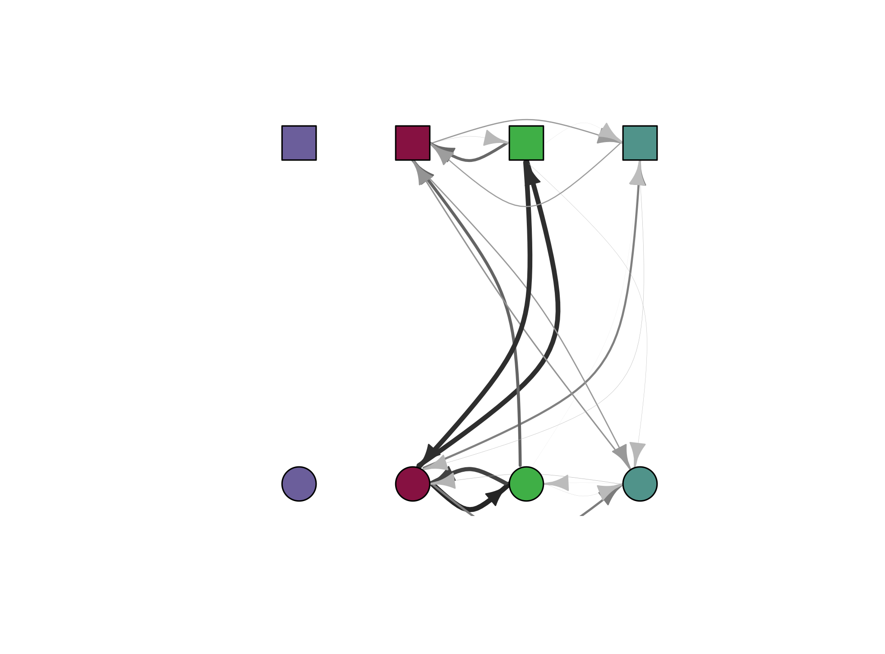
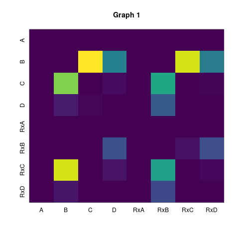
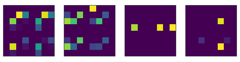
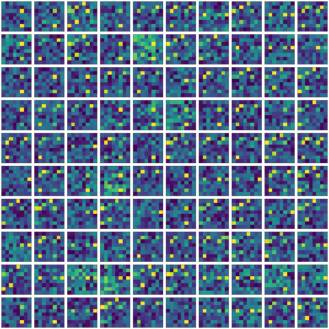
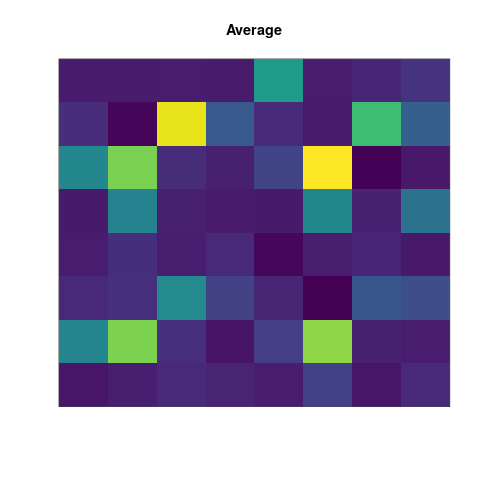
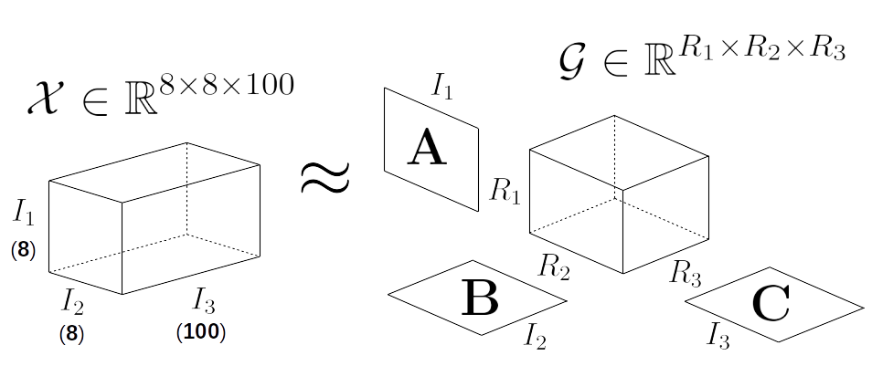
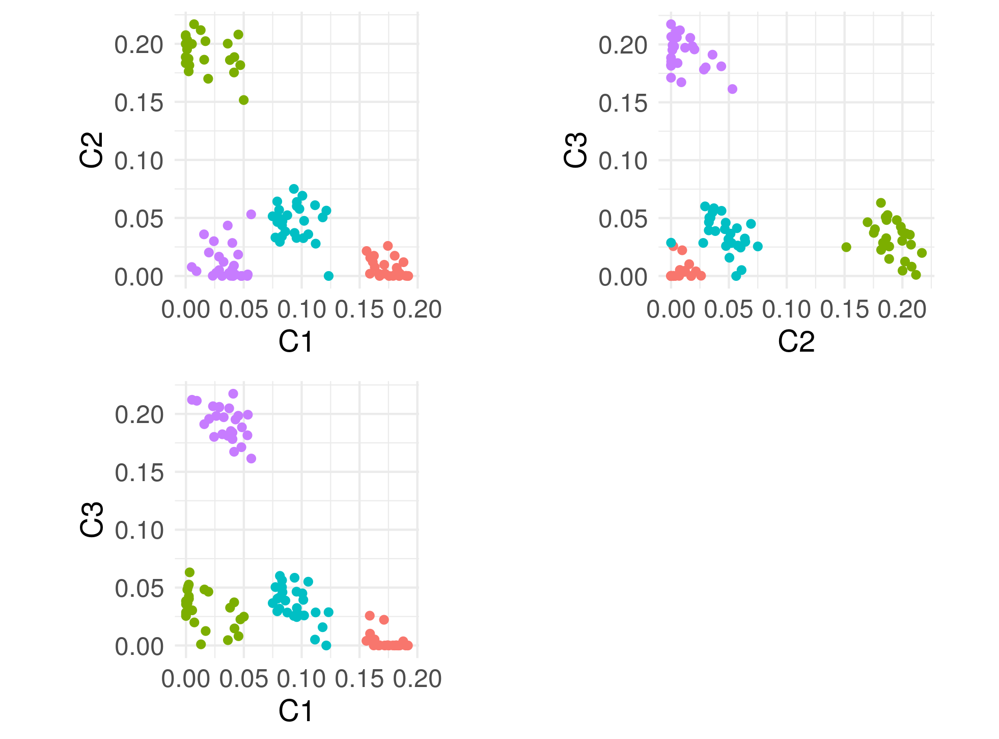

```{r 'setup', include = FALSE, message=FALSE, cache = FALSE}
rm( list = ls() )
require(rTensor)
require(nnTensor)
require(abind)
require(viridis)
options(knitr.table.format = "html") 


```


Here's the problem set-up: we have a group of diseases/disorders/conditions (A,B,C and D) and associated known treatments (RxA, RxB, RxC and RxD).  We want to build [graphs](https://en.wikipedia.org/wiki/Graph_(discrete_mathematics)#Definitions) that represent associations between the conditions and treatments for a group of patients.  We are given time-ordered data (from their medical records) that records a sequence of recorded episodes (but not the precise dates of each) of both conditions and treatments.  Ultimately, we want to discover patterns of common treatments and conditions to derive some understanding of multimorbidity.

An example:

```{r echo = FALSE, warning=FALSE, fig.align='center', out.width="100%"}
#{r out.width='80%', fig.show='hold', echo = FALSE}

```

The circles represent mentions of disorders and the squares treatment episodes.  Here, we can see someone with a life-long condition (A) for which they had continuous treatment (or at least, at the resolution of recording, whenever A was mentioned, RxA was also).  At some point, they develop an episode of condition B and on the second occurrence, they're prescribed treatment RxB.  And so on.  We can see that we could represent each time-ordered series as a binary indicator vector, for instance condition B = (0,0,1,1,0,0,1,1,1) and treatment RxD = (0,0,0,0,0,1,1,0,0).

We can construct a graph where nodes/vertices are the conditions and treatments, and the edges between represent relationships.  In this example, A and RxA *always* co-occur together so if an edge represents co-occurence, this would be a very strong association.  Another method of constructing the graph is to systematically time-lag each condition/treatment vector and see if there's a consistent pattern of e.g. condition B always preceding RxB.  To do this, we use pairwise [transfer entropy](https://en.wikipedia.org/wiki/Transfer_entropy) (which generalises the notion of Granger temporality) for each pair of conditions and treatments.

If we do this for the above time-ordered data, we get the following directed graph (note, squares are treatments and circles conditions):

```{r out.width='80%', fig.show='hold', echo = FALSE}

```

This graph can be parsimoniously represented as an adjacency matrix: rows and columns represent conditions/treatments and the $(i,j)$th element is the strength of association (i.e. that condition/treatment $i$ precedes condition/treatment $j$).  For the graph above, the adjacency matrix looks like:

```{r out.width='60%', fig.show='hold', echo = FALSE}

```

Importantly, it's an asymmetric directed graph, so the direction (as well as the strength) of associations matter.  Ultimately, for this blogpost, it doesn't really matter how the graph is constructed, just that we have a bunch of graphs represented as adjacency matrices.

For this simulation, we built 4 example time-ordered sequences of conditions/treatments and then derived the adjacency matrices as before, resulting in the following 4 exemplar graphs:

```{r out.width='80%', fig.show='hold', echo = FALSE}

```

Then, we derive 25 noisy variations of each examplar, giving us 100 samples as follows:
```{r out.width='80%', fig.show='hold', echo = FALSE}

```

Now assume that we are given the 100 noisy samples and we want to discover underlying graphs (which of course, in this simulated example, we know is 4 and we know what they look like).  We can see glimpses of the original 4 exemplars in the table of samples, but if we take the "average" graph (adjacency matrix) we'd get this:
```{r out.width='60%', fig.show='hold', echo = FALSE}

```

[Graph partitioning](https://en.wikipedia.org/wiki/Graph_partition) methods try and tease out collections (or communities) of nodes/edges that form discrete graphs by selecting and cutting edges.  One approach to this is spectral partitioning where first, we derive the Laplacian matrix (from the adjacency matrix) and perform eigen- or singular value decomposition (SVD) on it -- to me, this seems like magic: you can carve up a graph (represented as an adjacency matrix) using linear algebra.  I recently learned about non-negative matrix factorisation from a paper by @hassaine2020untangling on multimorbidity in clinical data which prompted me to read the original paper [@lee1999learning] and a bit like SVD, seemed like more magic to me. Further, @hassaine2020untangling described using tensors -- collections of matrices -- for a similar task.

So here we have our problem: given a bunch of 100 noisy adjacency matrices above, extract the underlying 'exemplar' or prototype graphs.  The case presented here is not dissimilar to ideas in image processing -- each matrix is a noisy image and we want to find some underlying latent structure. If each of the 100 noisy adjacency matrices is a sample, it seems logical to 'stack' them up and see what can be learned from this 'stack'.  A series of matrices can be stacked up into a multidimensional array structure (a tensor) and there's a literature on how to perform decomposition (akin to SVD) on tensors.  So you can see how the logic proceeds: if matrix decompositions (like SVD) can can be used to partition a single graph (connectivity matrix), then maybe tensors can help tease out common structure in a stack of adjacency matrices.  

# Tensors
There are plenty of great online resources on [tensors](https://en.wikipedia.org/wiki/Tensor#Definition) and multilinear algerbra.  One source that I found spectacularly helpful was [Alexej Gossman's](https://www.alexejgossmann.com/) tutorial on Tucker and Rank-1 decompositions, not least because it serves as an introduction to programming with tensors in R. A frequently-cited and comprehensive tutorial paper is [@kolda2009tensor] which contains the formal details alluded to here and from which we borrow notation.  Much of what follows are notes to help me remember the core concepts.  

A tensor is essentially a multi-dimensional array -- much the same as the notion of a multi-dimensional array of numbers in programmning languages -- and generalises familiar objects like vectors and matrices.

A tensor has an **order** which equates the number of dimensions of the array.

An **order one** tensor is a vector $\mathbf{v} = \left[ v_1, v_2, \ldots, v_{I_1} \right]$ with $I_1$ elements (i.e. is of length $I_1$).  A vector of real numbers is denoted $\mathbf{v} \in \mathbb{R}^{I_1}$ (and in what follows, all our tensors will contain real elements). 

An **order two** tensor is a matrix $\mathbf{M} \in \mathbb{R}^{I_1 \times I_2}$ with $I_1$ rows and $I_2$ columns.

Before getting carried away, a simple motivating example.  Take the matrix $\mathbf{M} \in \mathbb{R}^{2 \times 3}$

```{r}
M <- matrix( c(1,2,3,4,5,6), nrow = 2, ncol = 3, byrow = TRUE )
M
```

If we want the first *row* of the matrix $\mathbf{M}$ we'll write this as $\mathbf{M}_{1:}$ which we read as "set the row index $i_1 = 1$ and retrieve *all* columns" yielding (`r M[1,]`). 
Similarly, if we want the third *column* of $\mathbf{M}$ we'll write this as $\mathbf{M}_{:3}$, to be read as "set the column index $i_2 = 3$ and retrieve all rows" yielding (`r M[,3]`).

## Modes and Fibres
Translating to the language of tensors; instead of discussing rows or columns, we generalise to **fibres** and **modes**:

  * a matrix is a 2nd order tensor with indices $i_1$ and $i_2$
  * index $i_1$ refers to the **first mode** 
  * index $i_2$ refers to the **second mode**

```{r echo = FALSE}
print( M )
```

Then, we have:

  * the **mode-1 fibres** of the matrix above are the columns denoted by $\mathbf{M}_{:j}$ which are (`r M[,1]`), (`r M[,2]`) and (`r M[,3]`), 
  * the **mode-2 fibres** are the rows of the matrix above, denoted by $\mathbf{M}_{i:}$ which are (`r M[1,]`) and (`r M[2,]`)

Fibres of a tensor are obtained by 'fixing' all but one of the mode indices.

## Third Order Tensors and Slices

Now we come to **third order** tensors $\mathbf{\mathcal{X}} \in \mathbb{R}^{I_1 \times I_2 \times I_3}$ representing a "cuboid" of elements with three modes and indices ranging from $i_1 = 1 \ldots I_1$, $i_2 = 1 \ldots I_2$ and $i_3 = 1 \ldots I_3$.  

Let's illustrate this by first of all defining two matrices of size $2 \times 3$: 

```{r}
X1 <- matrix( c(1,2,3,4,5,6), nrow = 2, ncol = 3, byrow = TRUE )
X2 <- matrix( c(7,8,9,10,11,12), nrow = 2, ncol = 3, byrow = TRUE )
print(X1)
print(X2)
```

And now, glue them together in the third mode with `X1` at the front and `X2` behind:

```{r}
X <- as.tensor( abind( X1, X2, along = 3 ) )
print(X@data)
```

By "stacking" `X1` and `X2` we've built the tensor $\mathbf{\mathcal{X}} \in \mathbb{R}^{2 \times 3 \times 2}$.

This illustrates **slices** -- by fixing all the indices except two, we obtain a matrix that represents a 'cut' through the tensor in two of the modes.  The **frontal slices** are $\mathbf{X}_{::k}$ and are simply the two matrices `X1` and `X2` in the code above.  Note that we use the R package [`rTensor`](https://cran.r-project.org/package=rTensor) which provides a class for tensor representations.

We can slice the tensor on different modes, obtaining **horizontal slices** $\mathbf{X}_{i::}$

```{r}
X[1,,]@data
X[2,,]@data
```

And **lateral slices** $\mathbf{X}_{:j:}$

```{r}
X[,1,]@data
X[,2,]@data
X[,3,]@data
```

We're not going to need more than 3rd order tensors for what follows, so we won't generalise further.

## Matricization and Vectorization of Tensors
Order 3 tensors are cuboids and this is intutive.  But if the order is higher, it becomes very hard to visualise, manipulate and define operations on tensors.

One simple transformation is to **vectorize** the tensor, which simply means 'flattening' the tensor into a vector following some convention for how elements are "read out" by systematically varying the indices with respect to each other (e.g. $i_1$ varies slower than $i_2$).  We denote this operation $\text{vec}(\mathcal{X})$ which gives:

```{r}
rTensor::vec(X)
```
Notice that this look like a vector of the column fibres of each frontal slice -- i.e. (`r X[,1,1]@data`)$^T$, (`r X[,2,1]@data`)$^T$, (`r X[,3,1]@data`)$^T$ ... concatenated together. 

**Matricization** is the transforming of a tensor into a matrix represention by **unfolding** the tensor along a mode.  This helps us visualise as well as understand operations on tensors.  The sources to understand this in detail are @kolda2009tensor and @bader2006algorithm.

An **n-mode matricization** of a tensor yields a matrix with columns being the mode-n fibres of the tensor.  

Take our $2 \times 3 \times 2$ tensor $\mathcal{X}$:
```{r}
X@data
```

If we unfold the tensor along the *first* mode we get the two frontal slices (matrices) $\mathbf{X}_{::1}$ and $\mathbf{X}_{::2}$ concatenated side-by-side as a matrix $\left[ \mathbf{X}_{::1} \mid \mathbf{X}_{::2} \right]$ and we denote this with a bracketed subscript indicating the mode $\mathbf{X}_{(1)}$
```{r}
k_unfold(X, m = 1)
```

And if we unfold on the second mode $\mathbf{X}_{(2)}$ we get the transposed frontal slices arranged side-by-side $\left[ \mathbf{X}^{\intercal}_{::1} \mid \mathbf{X}^{\intercal}_{::2} \right]$
```{r}
k_unfold(X, m = 2)
```

Finally, unfolding in the third mode $\mathcal{X}_{(3)}$ we get:
```{r}
k_unfold(X, m = 3)
```

Which is the matrix :
$$
  \begin{bmatrix}
    \text{vec}(\mathcal{X}_{::1})^T \\
    \text{vec}(\mathcal{X}_{::2})^T
  \end{bmatrix}
$$
That is, the first and second rows are the vectorization of the first and second frontal slices respectively:

```{r}
rbind( vec(X[,,1]), vec(X[,,2] ) )
```

## Tensor-Matrix Products
An important operation is the product of a tensor and a matrix along the $n$th mode, or the **n-mode product**.  Restricting out attention to order 3 tensors ("cubes") -- we multiply the tensor $\mathbf{\mathcal{X}}^{I_1 \times I_2 \times I_3}$ with a matrix $\mathbf{M} \in \mathbb{R}^{J \times I_n}$ where $n$ is mode 1, 2 or 3. 

To my mind, the definition of the n-mode product is most easily understood in terms of matricization (unfolding), matrix products and the folding the result back into a tensor. The expression for the element-wise calculation is given in [@kolda2009tensor] pp. 460.

For example, take the matrix $\mathbf{Q} \in \mathbb{R}^{3 \times 2}$:
```{r}
Q <- matrix( c(1,1,2,2,3,3), nrow = 3, ncol = 2, byrow = TRUE )
print(Q)
```

To multiply $\mathbf{Q}$ by mode $n$ of the tensor $\mathbf{\mathcal{X}}$ we perform this sequence of operations:

  1. Let $\mathbf{X}_{(n)}$ be the $n$ mode unfolding of $\mathbf{\mathcal{X}}$
  2. Compute the matrix product $\mathbf{X'}_{(n)} = \mathbf{Q} \mathbf{X}_{(n)}$
  3. Fold $\mathbf{X'}_{(n)}$ along the $n$-th mode
  
Note, this only makes sense if the dimensions of the matrix $\mathbf{Q}$ are conformable with the unfolding of the tensor i.e. that the number of columns in $\mathbf{Q}$ equals $I_n$, the size of mode $n$ in the tensor

Let's do this for the first mode of our example.  Here's our tensor $\mathbf{\mathcal{X}}$ again:
```{r}
print(X@data)
```

Mode 1 of $\mathbf{\mathcal{X}}$ is of size $I_1 = 2$ and our matrix $\mathbf{Q}$ has two columns, so we're good.

  1. Unfold $\mathbf{\mathcal{X}}$ along the first mode $\mathbf{X}_{(1)}$

```{r}
# mode to take product with
n <- 1
X_1 <- k_unfold( X, n )@data
print(X_1)
```

  2. Compute the matrix product $\mathbf{X'}_{(1)} = \mathbf{Q} \mathbf{X}_{(1)}$
  
```{r}
X_1_prime <- Q %*% X_1
print( X_1_prime )
```

  3. Fold $\mathbf{X'}_{(1)}$ along the $n$-th mode

```{r}
# compute the required modes for the resulting folded tensor
Q.dims <- dim(Q)
modes.X_prime <- X@modes
modes.X_prime[n] <- Q.dims[1]
# fold
Q_by_X.1 <- k_fold( X_1_prime, n, modes.X_prime )
print( Q_by_X.1@data )
```

Naturally, there's a function to do this for us in one simple step:
```{r}
rTensor::ttm( X, Q, m = 1)@data
```

# Matrix Decompositions
We can now venture into the decompositions, or factorizations, of matrices and tensors.

## Singular Value Decomposition
```{r}
set.seed(314159)
A <- matrix(  c(1,0,0,1,
                1,0,0,1,
                1,1,1,1,
                1,0,0,1,
                1,0,0,1), ncol = 4, nrow = 5, byrow = TRUE)


A <- A + runif( 4*5, -0.1, 0.3)

UDV <- svd(A)
U <- UDV$u
D <- diag(UDV$d)
V <- UDV$v

recon.4 <- U[,1:4] %*% D[1:4,1:4] %*% t(V[,1:4])
recon.2 <- U[,1:2] %*% D[1:2,1:2] %*% t(V[,1:2])

par(mfrow=c(1,3),
      mar = c(0.5,0.5,2,0.5),
      pty = "s")
    image( t(A), xaxt = "n", yaxt = "n", col = viridis(256), main = "Original" )
    image( t(recon.4), xaxt = "n", yaxt = "n", col = viridis(256), main = "k=4" )
    image( t(recon.2), xaxt = "n", yaxt = "n", col = viridis(256), main = "k=2" )
    
    

```
This diagram shows on the left, an original image (a sort of noisy "H" shape) represented by a matrix $\mathbf{M} \in \mathbb{R}^{5 \times 4}$.

We subject this to a [singular valued decomposition](https://en.wikipedia.org/wiki/Singular_value_decomposition):
$$
  \mathbf{M} = \mathbf{UDV}^{\intercal}
$$
where the factor matrices are:

  * $D$ is the diagonal matrix of singular values, with largest value in the top left, descending to the smallest along the diagonal:
```{r}
print(D)
```

  * $U$ is a matrix of $5 \times 4$ left singular vectors of $\mathbf{M}$
```{r}
print(U)
```

  * $V$ is a matrix of $4 \times 4$ right singular vectors of $\mathbf{M}$
```{r}
print(V)
```
  
We can now 'reconstruct' an approximation to the original image $\widetilde{\mathbf{M}} = \mathbf{UDV^{\intercal}}$ and this is shown in the middle picture with $k = 4$ denoting that we use all 4 of the singular vectors.

The "magic" alluded to earlier is when we use a **truncated** version of the SVD -- take the first $1 \ldots k$ singular vectors and use these to reconstruct the image:
$$
  \widetilde{\mathbf{M}} = \mathbf{U}_{:k} \mathbf{D}_{kk} \mathbf{V}^{\intercal}_{:k}
$$
With $k=2$, we get the third image on the right; a reconstructed image using half the vectors (i.e. compressed) which additionally helps de-noise the original image.

## Non-Negative Matrix Factorisation
Another decomposition (factorisation) is the **non-negative** matrix factorisation or NMF (see @lee1999learning for details).  Here, we factor:
$$
  \mathbf{M} = \mathbf{WH}^{\intercal}
$$
subject to the constraint that the factor matrices $\mathbf{W}$ and $\mathbf{H}$ are non-negative (cf. the matrices $\mathbf{U}$ and $\mathbf{V}$ in SVD as shown above).  This results in an algorithm for estimating the factor matrices which is iterative for each element of $\mathbf{W}$ and $\mathbf{H}$.  The remarkable feature of NMF is that the resulting factor matrices have a component-parts interpretation as follows;  the columns of $\mathbf{H}$ are **encodings** and columns of $\mathbf{W}$ are **weights** that map encodings to weighted-sums in $\mathbf{M}$.

This means, we can use a truncated NMF decomposition to partition "component parts" of $\mathbf{M}$.

As an example, with the same noisy "H" image, we apply NMF truncating to $k=2$ and reconstruct:

```{r}
nmf.1 <- NMF(A, J=2)
W <- nmf.1$U
H <- nmf.1$V

recon.nmf <- W %*% t(H)


par(mfrow=c(1,2),
      mar = c(0.5,0.5,2,0.5),
      pty = "s")
    image( t(A), xaxt = "n", yaxt = "n", col = viridis(256), main = "Original" )
    image( t(recon.nmf), xaxt = "n", yaxt = "n", col = viridis(256), main = "NMF (k = 2)" )    
    
    

```

The result is very similar to SVD.  The "magic" here is in the following trick -- take each column of $\mathbf{W}_{:i}$ and multiply it by the corresponding column of $\mathbf{H}^{\intercal}_{:i}$ and we get:

```{r}
recon.nmf.1 <- W[,1] %*% t(H[,1])
recon.nmf.2 <- W[,2] %*% t(H[,2])
recon.nmf.sum <- recon.nmf.1 + recon.nmf.2

par(mfrow=c(1,3),
      mar = c(0.5,0.5,2,0.5),
      pty = "s")
    image( t(recon.nmf.1), xaxt = "n", yaxt = "n", col = viridis(256), main = "W x H (1st column)" )    
    image( t(recon.nmf.2), xaxt = "n", yaxt = "n", col = viridis(256), main = "W x H (2nd column)" )
    image( t(recon.nmf.sum), xaxt = "n", yaxt = "n", col = viridis(256), main = "Sum" )

```
So we see that the columns of the factor matrices capture component parts of the source matrix and reconstruction is the sum of those component parts.  This is a direct consequence of imposing the constraint that the elements of $\mathbf{M} = \mathbf{WH}^{\intercal}$ must be non-negative.

We can repeat the experiment with $k=3$:

```{r}
set.seed(314150)
nmf.2 <- NMF(A, J=3,  algorithm = "Frobenius")
W <- nmf.2$U
H <- nmf.2$V

recon.nmf <- W %*% t(H)

recon.nmf.1 <- W[,1] %*% t(H[,1])
recon.nmf.2 <- W[,2] %*% t(H[,2])
recon.nmf.3 <- W[,3] %*% t(H[,3])
recon.nmf.sum <- recon.nmf.1 + recon.nmf.2 + recon.nmf.3

par(mfrow=c(1,4),
      mar = c(0.5,0.5,2,0.5),
      pty = "s")

    image( t(recon.nmf.1), xaxt = "n", yaxt = "n", col = viridis(256), main = "W x H (1st column)" )    
    image( t(recon.nmf.2), xaxt = "n", yaxt = "n", col = viridis(256), main = "W x H (2nd column)" )
    image( t(recon.nmf.3), xaxt = "n", yaxt = "n", col = viridis(256), main = "W x H (3rd column)" )
    image( t(recon.nmf.sum), xaxt = "n", yaxt = "n", col = viridis(256), main = "Sum" )

```
Notice now that the three components are the right and left vertical 'bars' and the one horizontal bar.  The problem is, with $k=2$ the solution found by NMF is stable (i.e. it always extracts a component with the two vertical bars, and one hortizontal) but with $k=3$ the solution varied significantly between runs of the iterative NMF algorithm; sometimes local optima are found which make sense, other times we get less meaningful decompositions.  These variable results are not shown here because we fix the pseudo-random number generator seed for reproducibility.

One of the problems with applying NMF is finding the right $k$ that reflects the desired component-parts decomposition in the problem domain. 

# Tensor Decomposition
For a survey of tensor decomposition techniques, @kolda2009tensor is the go-to source.  Here, we'll focus on one decomposition that mirrors NMF for tensors, the **non-negative Tucker decomposition** (NTD) for mode-3 tensors.  Instead of having a target matrix, decomposed by multiplying factor matrices together, we have a more complex problem of factorising a cuboid.  Recall our example: 100 noisy samples derived from 4 'prototypical' graph adjacency matrices.

With tensors, the intuitions from matrix decomposition apply, but instead of dealing with products of matrices, we now have a more complex situation shown below:

```{r out.width='80%', fig.show='hold', echo = FALSE}

```

The Tucker decomposition is then:
$$
\mathcal{X} = \mathcal{G} \times_1 \mathbf{A} \times_2 \mathbf{B} \times_3 \mathbf{C} 
$$

Here:

  * $\mathcal{X}$ is the tensor of dimensions $I_1 \times I_2 \times I_3$ which for our application represents the $8 \times 8$ adjacency matrices stacked in the third mode to build a tensor of size $8 \times 8 \times 100$
  * $\mathcal{G}$ is the **core tensor** which has dimensions $R_1 \times R_2 \times R_3$ and is smaller than the dimensions of $\mathcal{X}$ where each $R_j \leq I_j$ -- therefore, the core tensor "compresses" the information in $\mathcal{X}$
  * $\mathbf{A}$, $\mathbf{B}$ and $\mathbf{C}$ are the **factor matrices** which have dimensions $I_1 \times R_1$, $I_2 \times R_2$ and $I_3 \times R_3$ respectively.    

By analogy with principal components analysis, the factor matrices $\mathbf{A}$, $\mathbf{B}$ and $\mathbf{C}$ are the principal components in each of the modes and the core tensor represents the interactions between the components [@kolda2009tensor].

The iterative algorithm for computing the factor matrices and core tensor subject to non-negativity constraints can be found in in Chapter 7 of [@cichocki2009nonnegative] and connections to latent structure and statistics can be found in [@shashua2005non].  Here, we use the [`nnTensor`](https://cran.r-project.org/package=nnTensor) package implementation for NTD. 

# Application
Let's return to the example we started with, recovering adjacency matrices from 100 noisy samples.

The code for what follows is computationally expensive (so I've not shown the code here)

## Finding an Appropriate Rank for the Core Tensor
The example of NMF on the "H" image above demonstrates that knowing *in advance* what the expected components are helps decide on the truncation (or reduced rank) to use.  In the tensor example of 100 adjacency matrices, assume we don't know that there are four prototypical adjacency matrices in advance.  We need to decide on the size of the core tensor (and the corresponding factor matrices) without this information.

Recall also that the core tensor is a compressed representation of the data in each of the three modes.

Here's the approach; we use NTD to obtain a compressed representation and treat the factor matrix $\mathbf{C}$ (corresponding to the third mode of the tensor $\mathcal{X}$) as a projection (i.e. dimensionality reduction) to locate a candidate number of clusters for all 100 samples. 

  1. Compute a low-rank NTD with $R_1 = R_2 = 8$ and $R_3 = 3$ -- so, compressing over the third mode (the 'stacking' of the adjacency matrices) but leaving the modes corresponding to the adjacency matrix rows/columns uncompressed.  Reducing on $R_3 = 3$ is somewhat arbitrary, but allows us to visualise the resulting factor matrix $\mathbf{C}$ in Step 2
  2. Take the factor matrix $\mathbf{C} \in \mathbb{R}^{100 \times 3}$ which represents each of the 100 adjacency matrices projected in a space $\mathbb{R}^3$
  3. Perform *k*-means clustering in $\mathbb{R}^3$ with multiple re-starts over a range of candidate cluster numbers (e.g. 2 through to 10 clusters); for each number of clusters, use the Gap statistic to ascertain the optimal number of clusters [@tibshirani2001estimating].
  4. Repeat steps 1--3 a number of times (say, 20) recording the optimum number of clusters located in Step 3
  5. Take the mode number of clusters $\#c$

We repeat steps 1--3 because (as for NMF) NTD uses an iterative algorithm not guaranteed to find a global optimum and often, NTD locates quite different factorisations for different initialisations.  

On our example data, here's what we obtain:

```{r out.width='80%', fig.show='hold', echo = FALSE}

```

Each plot is one of three projections of $\mathbf{C}$ (it looks a lot cooler as a 3D plot but it's harder to see the clusters clearly).  So we can locate 4 distinct clusters, each corresponding to one of the 'prototype' network graphs from earlier:

```{r out.width='80%', fig.show='hold', echo = FALSE}

```


